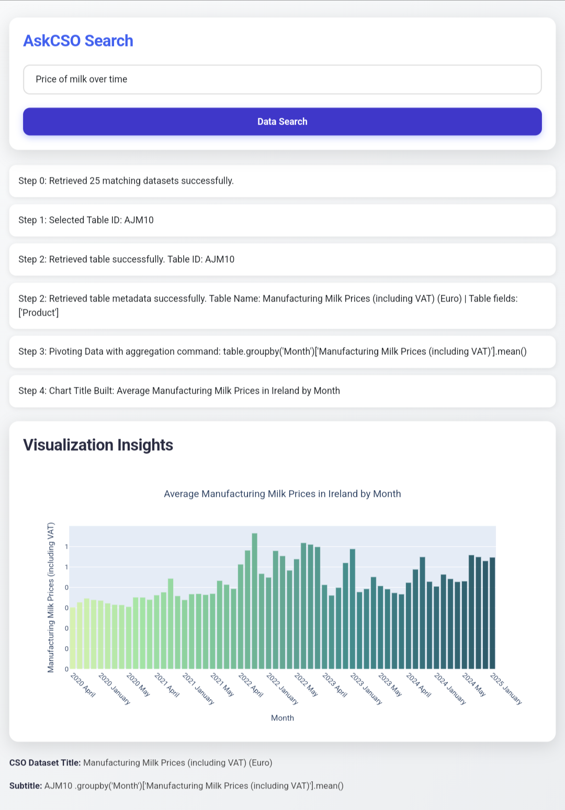

# Index Maker & Query Server

This project aims to delivery a fast LLM powered search and wrangle engine for Ireland's CSO database. Only metadata is stored locally - all statistics are generated by live calls to the CSO database and pivots on the data are generated by LLM calls. The repository contains Jupyter notebooks for initial setup of the search index and Python scripts for data processing, server setup, and query handling. It is also Dockerized for ease of deployment.

## Table of Contents

- [Overview](#overview)
- [Project Structure](#project-structure)
- [Setup and Installation](#setup-and-installation)
- [Usage](#usage)
- [Docker Instructions](#docker-instructions)
- [Screenshots](#screenshots)
- [Contributing](#contributing)
- [License](#license)

## Overview

This project involves several steps:

- **Data Processing:**  
  The notebook `Build_cso_df_pickle.ipynb` contains code to create a pandas dataframe consisting of CSO databse metadata which is then saved as pickle files.
  The notebook  `Make_index_from_pickle.ipynb` reads that pickle file and creates a vectorized search index which is also saved as a pickle. You may ingnore these notebooks and use the pickle proved on this repo.

- **Server Setup:**  
  The `server.py` script sets up a flask server to host the webpage and displays the data, while `query.py` handles queries to the CSO database and Groq API.

- **Containerization:**  
  The `Dockerfile` is used to build a container for easy deployment.

## Project Structure

```
├── Make_index_from_pickle.ipynb      # Notebook to create an index from a pickle file
├── Build_cso_df_pickle.ipynb         # Notebook to build a CSO dataframe and pickle file
├── server.py                         # Python script to run the query server
├── query.py                          # Python script to process queries
├── templates/index.html              # Webpage
└── Dockerfile                        # Docker configuration for containerizing the app
```

## Setup and Installation

1. **Clone the Repository:**

   ```bash
   git clone https://github.com/yourusername/your-repo-name.git
   cd your-repo-name
   ```

2. **Create a Virtual Environment (optional but recommended):**

   ```bash
   python3 -m venv venv
   source venv/bin/activate   # On Windows use `venv\Scripts\activate`
   ```

3. **Install Dependencies:**

   If you have a `requirements.txt` file:

   ```bash
   pip install -r requirements.txt
   ```

   Otherwise, ensure you have the necessary packages installed (e.g., Flask, Pandas, etc.) as required by your scripts and notebooks.

## Usage

1. **Generate the Index:**

   Open and run `Make_index_from_pickle.ipynb` in Jupyter Notebook to create the index from your pickle files.

2. **Build the CSO Dataframe:**

   Open and run `Build_cso_df_pickle.ipynb` to process your data and generate a CSO dataframe pickle.

3. **Run the Server:**

   Start the server by executing:

   ```bash
   python server.py
   ```

4. **Query the Server:**

   Use the `query.py` script or access the server endpoint (e.g., via a browser or curl) to send queries and view results.

## Docker Instructions

To build and run the application in a Docker container:

1. **Build the Docker Image:**

   ```bash
   docker build -t index-query-server .
   ```

2. **Run the Container:**

   ```bash
   docker run -p 5000:5000 index-query-server
   ```

The server will be accessible on port 5000.

## Screenshots

Here are a couple of screenshots demonstrating key parts of the project:

- **Example Search:**

  

## Contributing

Contributions are welcome! Please fork the repository and submit pull requests for any improvements or bug fixes. For major changes, please open an issue first to discuss what you would like to change.

## License

This project is licensed under the [MIT License](LICENSE).

---

Feel free to adjust the sections to better fit your project details and add any additional information as needed.
